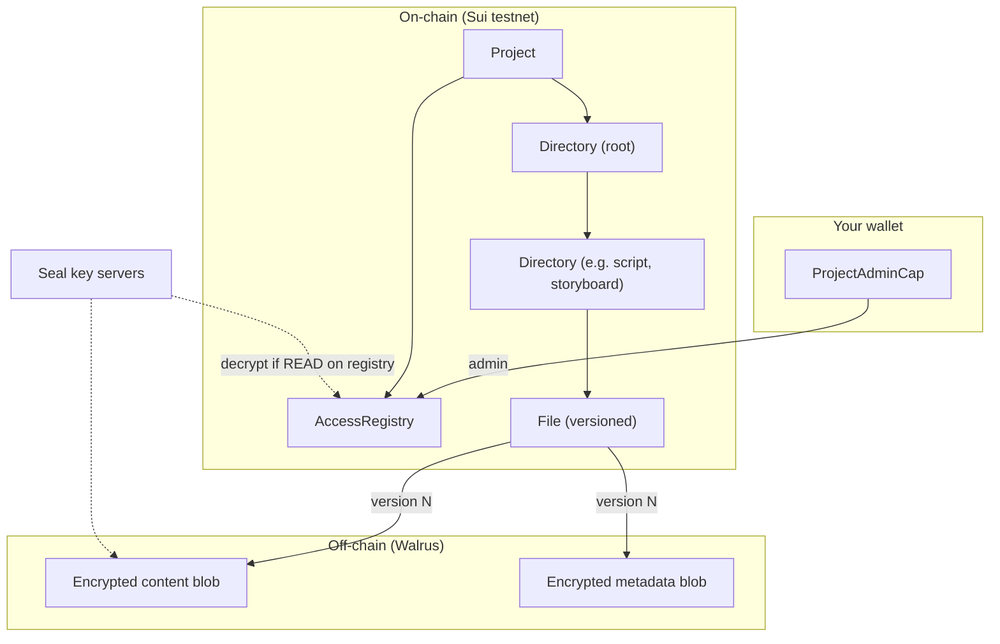

# Vive — Agentic Short-Form Video Studio on Sui + Walrus

**Vive** (Content Studio) is an AI production studio for short-form video. Creators work through a production pipeline — **Script → Design → Storyboard → Film** — with specialized agents that plan, generate, critique, and revise assets inside the workflow.

Every output artifact is stored on **Walrus**, encrypted with **Seal** (decentralized key servers on Sui), and indexed by an **on-chain directory** you control with your wallet. Each saved asset records the **prompt and model** used to produce it, so you can trace how work was generated. Only addresses granted read access on the project's access registry can decrypt content. Reconnect the same wallet on a new device to reload your projects from chain + Walrus.

**Routes:** `/` landing page · `/app` project hub · `/app/projects/:projectId` workspace · `/app/skills` reusable prompt playbooks

---

## Hackathon track alignment (Walrus)

AI video production generates many intermediate artifacts — scripts, prompts, images, storyboards, and clips — across multiple model calls. Vive uses Walrus as a durable, verifiable **storage layer** for that output, with Sui holding the catalog and access policy.

| Track requirement | How Vive delivers |
| --- | --- |
| **Persistent file access** | Scripts, design prompts, character/environment sheets, storyboard JSON, contact-sheet images, and video clips are Seal-encrypted Walrus blobs indexed by on-chain `File` and `Directory` objects. |
| **Multi-agent workflows** | A workflow orchestrator runs specialized agents (script, design, storyboard, film) with planner → executor → critic loops. Agent mode runs the full pipeline from a brief; control mode lets you generate and edit assets individually. |
| **Artifact-driven production** | Each asset is versioned on-chain. Agents and the UI read prior artifacts from Walrus when generating the next step. Saved documents include generation prompts and OpenRouter model IDs. |
| **Cross-session continuity** | Projects are rediscovered via owned `ProjectAdminCap` objects. Manifests, assets, conversations, and skills reload from the on-chain catalog and Walrus payloads. |

---

## What it does

1. **Asset-first workspace** — Browse scripts, character/environment art, storyboards, and video clips in a folder explorer. Jump between asset types freely; no phase approval gate blocks progress.
2. **Control mode** — Edit assets directly, chat with phase-scoped agents, and generate one script, design sheet, storyboard, or clip at a time.
3. **Agent mode** — Run a full production workflow from a brief: beat sheet → character/environment visuals → storyboard plan + contact sheets → video clips, end to end.
4. **Multi-model routing** — Route all LLM, image, and video calls through [OpenRouter](https://openrouter.ai) (300+ models). Pick different models for scripting, image generation, and video within the same project.
5. **Provenance on every artifact** — Scripts, design assets, storyboard cards/sheets, and film clips store the user brief or generation prompt plus the model ID used, persisted in Walrus alongside the content.
6. **You own the data** — Artifacts are Seal-encrypted via decentralized key servers, stored on Walrus, and gated by your Sui wallet and on-chain access registry. Only addresses you grant read access can decrypt your projects — nothing is locked to a single SaaS backend.

---

## Sui usage

Sui provides identity, on-chain ownership, access control, and a verifiable file catalog for the storage layer.

### Wallet & authentication

- Connect via **Sui wallet** or **Enoki zkLogin** (Google OAuth when configured).
- Default network: **Sui testnet**.
- In local development, a burner wallet is available for quick testing.

### `content_vault` Move package

Vive deploys the [`content_vault`](move/content_vault/) package on **Sui testnet**:

**Package ID:** `0x76f3e481bf63aa2ce148a46bc93038fa7153d83c1d87161876fcdeb70937916a`

(Also configured in [`src/constants.ts`](src/constants.ts).)

The package replaces a monolithic off-chain path index with a **project-scoped on-chain filesystem**: directories, versioned files, and an access-control registry. Walrus still holds the encrypted bytes; Sui holds the catalog, permissions, and blob pointers.

#### Object model

| Object | Ownership | Role |
| --- | --- | --- |
| **`Project`** | Shared | Root of a workspace or production project. Stores title, owner, and pointers to the access registry and root directory. |
| **`ProjectAdminCap`** | Owned (wallet) | Proves admin rights for a project. Required to grant/revoke access and update the on-chain title. Discovered by the app to find your projects. |
| **`AccessRegistry`** | Shared | Per-project ACL: maps wallet addresses to `READ` / `WRITE` / `ADMIN` permission flags. |
| **`Directory`** | Shared | Folder in the on-chain tree. Children are keyed by `blake2b256(project_id \|\| name)`. |
| **`File`** | Shared | Versioned file entry. Each version records Walrus content + metadata blob IDs, content hash, size, and storage epoch. New versions append without rewriting the parent directory. |



#### How it works

1. **Create a project** — One signed transaction calls `project::create_project`, which atomically creates a `Project`, `AccessRegistry`, root `Directory`, and `ProjectAdminCap`. The creator receives full `READ | WRITE | ADMIN` on the registry. The workspace project also seeds default folders (`script`, `characters`, `environments`, `storyboard`, `video clip`, `conversations`) in the same PTB.

2. **Write a file** — The app Seal-encrypts content and a small metadata JSON (filename, logical path, MIME type, size), uploads both to Walrus, then submits a `file::create_file` or `file::add_version` transaction. The on-chain `File` object stores blob IDs and hashes; the parent `Directory` gains or keeps a hashed-name entry pointing at the file.

3. **Read a file** — The app walks the on-chain directory tree (batched RPC), resolves the `File` object and current version, fetches ciphertext from Walrus, and requests decryption from Seal. Seal calls `seal_policy::seal_approve`, which checks that the caller holds **READ** on the project's `AccessRegistry` and that the Seal identity is prefixed with the project ID.

4. **Versioning** — Revisions call `add_version` on the existing `File` shared object only. The directory table is untouched, so frequent saves do not rewrite the whole tree.

5. **Collaboration (optional)** — The project admin can `grant` or `revoke` permissions on the `AccessRegistry` (e.g. read-only reviewer, write-capable co-editor).

#### Seal identity & access policy

Encryption identities are bound per file:

```
seal_id = project_id_bytes (32) || file_id_bytes (32) || nonce
```

`seal_policy::seal_approve` verifies the identity prefix matches the registry's project and that `ctx.sender()` has `READ` on that registry. Walrus nodes and aggregators see ciphertext only; decryption keys are released by Seal key servers only after the on-chain check passes.

#### Move modules

| Module | Responsibility |
| --- | --- |
| [`project.move`](move/content_vault/sources/project.move) | Create/finalize projects; link registry + root directory |
| [`directory.move`](move/content_vault/sources/directory.move) | Directory tree CRUD; move file entries between folders |
| [`file.move`](move/content_vault/sources/file.move) | Versioned files; Walrus blob pointers per version |
| [`access.move`](move/content_vault/sources/access.move) | `ProjectAdminCap`, `AccessRegistry`, grant/revoke |
| [`seal_policy.move`](move/content_vault/sources/seal_policy.move) | Seal `seal_approve` entry point |
| [`utils.move`](move/content_vault/sources/utils.move) | Name hashing, Seal ID helpers |
| [`events.move`](move/content_vault/sources/events.move) | On-chain events for indexing and audit |

### Seal encryption & decentralized key servers

Before upload, artifacts are encrypted with [Seal](https://docs.sui.io/concepts/cryptography/seal) using the `content_vault` package as the access policy. Seal uses **decentralized key servers** on Sui to manage encryption keys — no single party holds the keys, and decryption keys are released only when on-chain access checks pass.

To read content back, the app must present a valid Sui session key and an on-chain `seal_approve` call from an address with **READ** on the project's access registry. That means Walrus stores ciphertext only; **content is viewable only by wallets you have granted access** — not by storage nodes, aggregators, or the app operator without authorization.

---

## Walrus usage

Walrus is the **storage layer** for production output. Sui stores the directory tree and blob pointers; Walrus stores the encrypted payloads and the rich JSON documents that describe each asset.

### What is stored on Walrus

| Data | Purpose |
| --- | --- |
| **File content** | Scripts, design JSON, storyboard documents, images, video — Seal-encrypted payload bytes |
| **File metadata** | Per-version sidecar JSON: filename, logical path, MIME type, size |
| **Project registry** | Workspace-level project list (`registry.json` content) |
| **Project manifest** | Per-project asset index: version pointers and asset metadata |
| **Asset documents** | Per-asset JSON with content plus **generation prompt** and **OpenRouter model ID** (`generationModelId`) |
| **Agent conversations** | Versioned chat transcripts scoped by media/behavior mode |
| **User skills** | Reusable prompt playbooks invoked via slash commands |

The **directory tree and blob pointers** live on Sui (`Directory` / `File` objects), not in a separate Walrus path-index document.

### Storage flow

```
User / Agent produces content
        ↓
Build asset document (content + prompt + model id)
        ↓
Seal encrypt (identity = project_id || file_id || nonce)
        ↓
Upload content + metadata JSON to Walrus publisher (testnet)
        ↓
On-chain tx: create_file or add_version on File object
        ↓
Directory entry (hashed name) points at File; version stores blob IDs
```

Projects are isolated under logical paths like `project/{projectId}/…` inside your workspace. The on-chain directory tree maps those paths to `File` objects; Walrus holds the encrypted payloads. When you open the app on a new device, connecting the same wallet rediscovers projects via your owned `ProjectAdminCap` objects and reloads the catalog from chain + Walrus.

### On-chain catalog vs Walrus payloads

Sui stores **structure and pointers**; Walrus stores **bytes**:

| Tier | Where | What |
| --- | --- | --- |
| **Catalog** | Sui `Directory` / `File` objects | Tree layout, version list, blob IDs, content hashes, MIME type, Walrus end epoch |
| **Metadata** | Walrus blob (Seal-encrypted) | `filename`, `logicalPath`, `content_type`, `original_size` |
| **Content** | Walrus blob (Seal-encrypted) | Script text, design/storyboard/film JSON, images, video |

Each `File` version records two Walrus blob IDs — one for content, one for metadata — so the chain stays compact while rich filenames and paths live off-chain.

#### Logical path layout

The app uses path keys that resolve through the on-chain directory tree (root + seeded folders):

| Prefix | Contents |
| --- | --- |
| `registry.json` | Project list (workspace root file) |
| `Skills/…` | User skill playbooks |
| `project/{id}/manifest.json` | Per-project asset index |
| `project/{id}/Script/Assets/…` | Script versions |
| `project/{id}/Design/Characters/Assets/…` | Character design assets |
| `project/{id}/Design/Environments/Assets/…` | Environment design assets |
| `project/{id}/Storyboard/Assets/…` | Storyboard JSON and contact-sheet images |
| `project/{id}/Film/Assets/…` | Film clips and generated video |
| `project/{id}/Conversations/…` | Agent chat history and attachments |

Asset folders (`script`, `characters`, `environments`, `storyboard`, etc.) are created as child `Directory` objects under the project root when the workspace is provisioned.

#### Load order

```
ProjectAdminCap (owned)  →  discover Project
  → root Directory  →  walk hashed entries
    → registry.json (File)  →  project titles and IDs
    → project/{id}/manifest.json (File)  →  asset metadata
      → asset Files (scripts, images, video, conversations)
        → Walrus: decrypt content + metadata blobs
```

Each save uploads new encrypted blobs to Walrus and appends a version (or creates a `File`) in a signed transaction. Blobs are stored for a limited number of Sui epochs (default: 5 on testnet, ~5 days) unless extended — see [`src/lib/walrus/constants.ts`](src/lib/walrus/constants.ts).

#### Project registry (`registry.json`)

Lightweight project list used to populate the hub. Stored as an on-chain `File` at the workspace root. Schema (`src/lib/storage/types.ts`):

```typescript
interface ProjectRegistryDocument {
  type: "project-registry";
  version: 1;
  projects: ProjectRegistryRecord[];
  updatedAt: string; // ISO 8601
}

interface ProjectRegistryRecord {
  projectId: string;        // UUID
  title: string;
  walrusPathPrefix: string; // e.g. "project/{uuid}/"
  ownerAddress: string;
  manifestPath: string;
  createdAt: string;
  updatedAt: string;
}
```

Example (decrypted):

```json
{
  "type": "project-registry",
  "version": 1,
  "updatedAt": "2026-06-07T10:00:00.000Z",
  "projects": [
    {
      "projectId": "a1b2c3d4-e5f6-7890-abcd-ef1234567890",
      "title": "Summer Reel",
      "walrusPathPrefix": "project/a1b2c3d4-e5f6-7890-abcd-ef1234567890/",
      "ownerAddress": "0xabc...",
      "manifestPath": "project/a1b2c3d4-e5f6-7890-abcd-ef1234567890/manifest.json",
      "createdAt": "2026-06-01T08:00:00.000Z",
      "updatedAt": "2026-06-07T10:00:00.000Z"
    }
  ]
}
```

#### File metadata (Walrus, per version)

Each on-chain file version has a companion metadata blob:

```typescript
interface FileMetadataDocument {
  filename: string;
  logicalPath: string;   // e.g. project/{id}/Script/Assets/{assetId}/v1.txt
  content_type: string;
  original_size: number;
}
```

The app decrypts this alongside content to recover human-readable paths for search, the asset sidebar, and agent context.

### Artifact provenance

Saved asset documents carry generation metadata alongside the output:

- **Scripts** — `prompt` (user brief) and `generationModelId` (text model)
- **Design assets** — image `prompt` per character/environment and `generationModelId` (image model)
- **Storyboard cards/sheets** — `generationPrompt`, sheet `prompt`, and associated model choices
- **Film clips** — video `prompt` and `generationModelId` (video model)

Agents load prior artifacts from Walrus when revising or generating downstream assets. Project search indexes manifest entries and decrypted asset bodies so you can find scripts, prompts, and clips across a project.

---

## Architecture

```
┌─────────────────────────────────────────────────────────────┐
│  React app (Vite) — Landing + asset-based workspace         │
├─────────────────────────────────────────────────────────────┤
│  Control mode         │  Agent mode overlay                 │
│  (explorer + chat)    │  (full workflow orchestrator)       │
├───────────────────────┴─────────────────────────────────────┤
│  OpenRouter (LLMs)    │  Image / video generation APIs      │
├───────────────────────┴─────────────────────────────────────┤
│  WalrusStorage — Seal encrypt, Walrus upload, on-chain sync │
├──────────────────────────────┬──────────────────────────────┤
│  Walrus (encrypted blobs)    │  Sui content_vault package   │
│  content + metadata          │  Project / Directory / File  │
│                              │  AccessRegistry + Seal policy│
└──────────────────────────────┴──────────────────────────────┘
```

**Agent workflow stages:** script → characters → environments → storyboard plan → storyboard sheets → video clips.

---

## Prerequisites

| Tool | Version | Check |
| --- | --- | --- |
| [Bun](https://bun.sh) | ≥ 1.1 | `bun -v` |

You will also need:

- A **Sui testnet wallet** with a small amount of SUI (project creation and file-version transactions are on-chain).
- An **[OpenRouter API key](https://openrouter.ai)** for agent LLM calls (enter in the in-app Settings UI, or via `.env` for local dev).

Optional:

- **Enoki** public API key + Google OAuth client ID for zkLogin ([`.env.example`](.env.example)).

---

## Install and run

### 1. Clone and install

```bash
git clone <your-repo-url>
cd sui_overflow_2026_content_creation
bun install
```

### 2. Configure environment (optional)

```bash
cp .env.example .env
```

For local development you can either:

- **Settings UI (default)** — leave credentials empty, run the app, and paste your OpenRouter key when prompted; or
- **Env-based credentials** — set `VITE_CREDENTIAL_SOURCE=env` and `VITE_OPENROUTER_API_KEY=<key>` in `.env`.

Optional Enoki zkLogin variables are documented in [`.env.example`](.env.example).

### 3. Start the dev server

```bash
bun dev
```

Open [http://localhost:5173](http://localhost:5173).

### 4. First-time setup in the app

1. **Connect wallet** — use Enoki (if configured) or the dev burner wallet on Sui testnet.
2. **Add OpenRouter key** — via the setup modal or Settings.
3. **Create a workspace** — the app provisions an on-chain `Project` with default directories on first use (one-time signed transaction).
4. **Create a project** — production artifacts begin syncing to Walrus and the on-chain catalog.

### 5. Production build

```bash
bun run build
bun run preview   # optional local preview of dist/
```

The repo includes a [`vercel.json`](vercel.json) for static deployment (`dist/`).

---

## Deploying the contract (optional)

A testnet `content_vault` package is already deployed and configured in [`src/constants.ts`](src/constants.ts):

```
0x76f3e481bf63aa2ce148a46bc93038fa7153d83c1d87161876fcdeb70937916a
```

To publish your own copy:

```bash
cd move/content_vault
sui client publish --gas-budget 100000000
# Update TESTNET_VAULT_PACKAGE_ID in src/constants.ts
bun run codegen
```

---

## Tech stack

| Layer | Technology |
| --- | --- |
| Frontend | React 19, Vite, Tailwind CSS 4 |
| Agents | Vercel AI SDK + OpenRouter |
| Storage | Walrus (`@mysten/walrus`) |
| Encryption | Seal (`@mysten/seal`) — decentralized key servers; on-chain access policy |
| Chain | Sui testnet, `@mysten/dapp-kit`, Move `content_vault` (Project / Directory / File / ACL) |
| Auth | Sui wallet, Enoki zkLogin (optional) |

---

## Project structure

```
src/
  components/       UI — landing, workspace, agent chat, asset explorer
  lib/
    storage/        On-chain directory catalog, Walrus read/write helpers
    walrus/         Seal encrypt/decrypt, upload/download
    workflow-*      Multi-agent orchestration (control + agent modes)
  hooks/            Project context, Walrus session, agent workflow
move/content_vault/ Sui Move package (project, directory, file, access, seal_policy)
```

---

## License

[PolyForm Noncommercial License 1.0.0](LICENSE) — you may use, modify, and share this software for **non-commercial purposes only**. Commercial use requires separate permission from the copyright holder.
